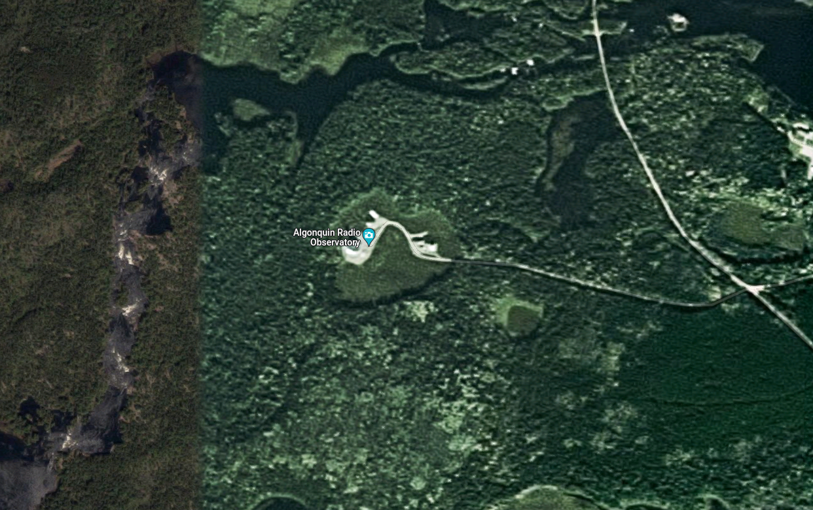
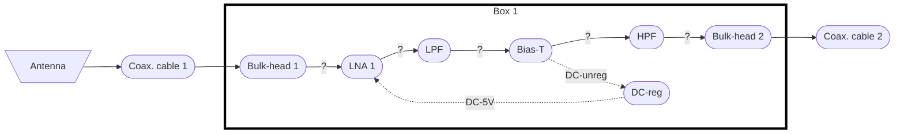
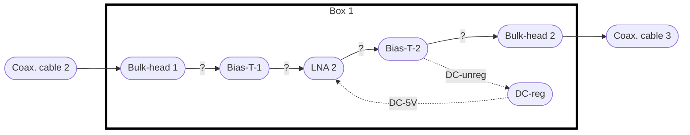

# ARO LPDA

* 8 log-periodic antennas
  + Separation 1-m, no pattern specified (1x8, 2x4, 3x3).
  + Semipermanent for a 6-months deployment.
* Ground plane.
* 8 RF-chains.
* Recording machine.
* Network gateway computer.

## Taskt to coordinate with Ben & Caroline.
* [ ] Define installation place.
  + Share pointing with CHIME.
  + Close to the basement.

## Tasks for Toronto
* [ ] Identify and order the antennas.
  + Order placed, waiting for them to arrive.
* [ ] Identify and order the analog chain component or maybe the cables.
  + In progress.
* [ ] Identify and order the computers.
* [ ] Recording computer with big memory (I have the old moose in my office, can we borrow some of the parts of it, need to spec it out).
* [ ] Network gateway computer (boris, we have the plan to buy it).
* [ ] Testing the antenna and analog chain.
* [ ] Install the computer os and software and test it out (Not sure how to test it without an iceboard (maybe lwlab has one)).
* [ ] Depending on the antenna mounting plan, we may need to build the mounting base.

## Tasks for ARO
* [ ] Shipping equipment to ARO?
* [ ] Install the antennas mounting to a solid base (Need to think about the snow environment) ** We will have to get a precise measurement of antenna locations and layout.
* [ ] Connect the cables between the analog chain and FPGA
* [ ] Integration test.
* [ ] Record crab pulses.
* [ ] Calibration of beamforming?

## RF chain

### Antenna and first stage

* Antenna: Y42400WB
* Coax. cable 1: ?
* Bulk-head: ?
* LNA1: ZX60-P33ULN+ 
* LPF: ?
* Bias-T to inject power: ? buy? design (and use it as high-pass filter? 😎
* HPF: ?
* Bulk-head: ?
* Coax. cable 2: ?
* Container box: ? Bud-Industries, somethin like this?
  [Amazon](https://www.amazon.ca/dp/B005T7BBM0/)
* Place it on the base of the antenna, or use the same box for 1st and 2nd
  stages?

### Second stage

* Bulk-head-1: ?
* Bias-T 1: buy? design (and use it as high-pass filter? 😎
* LNA-2: Noeelec Lana Barebones.
* Bias-T 2: buy? design (and use it as high-pass filter? 😎
* Bulk-head-2: ?
* Coax. cable 3:
  + RG-58?
  + Conduit to protect it?
  + Anchors?

### Coax to basement

### Basement rack unit
* 400-800 MHz filter: ZABP-598-S+.
* Bias-T: ? buy? design (and use it as high-pass filter? 😎
* Power supply.
* Voltaje regulators.
* Gain equalizer.
* LNA-3: Noeelec Lana Barebones.

## Suppliers
* Antenna - ???
* (8) LNA 1 - 
  [Mini-Circuits.com](https://www.minicircuits.com/WebStore/dashboard.html?model=ZX60-P33ULN%2B)
* (8) Band Pass Filter - ZABP-598-S+ - 410-785 MHz) -
  [Mini-Circuits.com](https://www.minicircuits.com/WebStore/dashboard.html?model=ZABP-598-S%2B)
* (8) Low-pass filters - VLF-800+ -
  [Mini-Circuits.com](https://www.minicircuits.com/WebStore/dashboard.html?model=VLF-800%2B)
* (16) LNA 2&3 -
  [Amazon.ca - Noeelec Lana Barebones](https://www.amazon.ca/dp/B07XNH6QW6/)
* 32 SMA bulkheads - [Amazon.ca](https://www.amazon.ca//dp/B07WFLD2MX/)

## Resources
* Antenna - Y42400WB [Datasheet](datasheets/Y42400WB-Spec-Sheet.pdf)
* LNA 1 - ZX60-P33ULN+ [Datasheet](datasheets/ZX60-P33ULN+.pdf)
* LNA 2&3 - Noeelec Lana Barebones [Datasheet](datasheets/lana_datasheet_revision_1.pdf)
* Band Pass Filter - ZABP-598-S+ - 410-758 MHz [Datasheet](datasheets/ZABP-598-S+.pdf)
* Low-pass filter - VLF-800+ [Datasheet](datasheets/VLF-800+.pdf)
